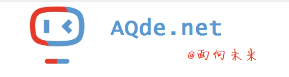

在国内使用互联网时请使用微软的搜索引擎：https://www.bing.com

# 常用的链接整理

教育版github：https://education.github.com/

我推荐大家使用的软件与资源都整理在这里了：https://g.aqde.net/books/invite

既然有这个优秀的平台存在，为什么还要维护一个html版的链接表呢？整理起来一点都不方便，不如直接写在这边来的更快更实用。

下面的分类更多是一种临时记录和官方网站：

## 临时的网络记录

EPIC家的虚幻引擎官方指导:https://docs.unrealengine.com/zh-CN/WhatsNew/index.html

B站的纪录片排行榜：https://www.bilibili.com/v/popular/rank/documentary 看上去还是很不错的。

凡人动漫：https://www.bilibili.com/bangumi/media/md28223043/

电影下载：https://www.ygdy8.com/index.html

纪录片下载：http://jlpcn.net/

## 内网主要设备管理

主路由：http://192.168.1.1/

主wifi:http://192.168.1.111/

隔层wifi:http://192.168.1.110/

蜗牛NAS DSM 6.2.3-25426：http://192.168.1.8:5000/

黑群晖DSM 5.2-5967 ：http://192.168.1.6:8091/

miniOP:http://192.168.1.254/

## 自己搭建的学习平台与成果

软路由的百度盘：http://192.168.1.1:5299/

软路由的KOD：http://192.168.1.1:8080

地云科技的早期网站：https://b.aqde.net:8/

DELL-bt面板：https://d.aqde.net:65534/

小型GL-inet远程:http://miniop.freeddns.org

NAS上的GitLab：http://x.aqde.net:30000

NNAS上的自建gitlab:https://aqgitlab.ddnsto.com/

黑群晖的SSL控制台：https://nas.aqde.net:9090/

黑群晖上的相册:https://nas.aqde.net:1980/photo/

黑群晖的SSL直接浏览：https://nas.aqde.net:1980/

文件交换工具：https://m.aqde.net:89

GHTxx软路由管理：https://aqghtxx.ddnsto.com/

GPD服务管理:https://gpdhome.ddnsto.com/

## 优秀的大厂平台

最强CDN平台：:https://dash.cloudflare.com/

苹果数据中心iCloud：https://www.icloud.com/

谷歌搜索引擎：https://www.google.com/ncr

开源软件社区：https://github.com/

世界最大域名注册与交易平台：https://sg.godaddy.com/zh

gTLD统计的通用顶级域名报表：https://ntldstats.com/

微软在线：https://outlook.live.com/

YouTobe：https://www.youtube.com/

油管字幕：http://www.youtube.com/timedtext_cs_panel?c=UCfxmIcT75BFyrFo0vkMy4Gg&tab=2

亚马逊云：https://ap-east-1.console.aws.amazon.com/ec2/home?region=ap-east-1#Home:

Facebook：https://www.facebook.com/

## 国际资讯

FBI资料库:https://vault.fbi.gov/

Fox News：https://www.foxnews.com/

纽约时报：https://cn.nytimes.com/

美股财报：https://longbridge.global/

国股财报：https://www.eastmoney.com/

## 精致的网络应用

航天器追踪:https://orbit.ing-now.com/satellite/48275/2021-035b/cz-5b/

网游变单机：[访问藏宝湾网游单机站](https://www.iopq.net/?fromuser=jarodlee)

BTC在线监控：https://www.nicehash.com/my/dashboard

国际网络测速平台：https://www.speedtest.net/

中国大陆网络测速:http://m.speedtest.cn/

最全的各种发行版Linux系统在线体验:https://distrotest.net/

腾讯搞了一个网络检测的工具:https://ping.huatuo.qq.com/

中国山寨版的chromeOS社区: https://community.fydeos.com/

动态域名直通:https://www.ddnsto.com/app/#/routers

花生壳管理:https://hsk.oray.com/console/manage/

快速搭建虚拟网:https://my.zerotier.com/

公共网络:

    8056c2e21ca09811

编程网络:

    565799d8f6ca2e34

大陆网站速率监控：https://monitoring.cloudwise.com/monitoring/#/dashboard

全球测速：http://www.speedtest.net/

安卓开源应用商店：https://f-droid.org/zh_Hans/

全历史网站：https://www.allhistory.com/

汉字萌典：https://www.moedict.tw/

g0v计划：http://g0v.asia/

台湾黑客松活动：https://presidential-hackathon.taiwan.gov.tw/en/

台湾数字化vTaiWan：https://vtaiwan.tw/

## 中国官方网站

安徽入学管理：http://ahrx.ahjygl.gov.cn

快递业投诉网站：http://sswz.spb.gov.cn/mine.html 【需要先向快递公司投诉7天后才可向此官网投诉，实名制】

中国环境污染网上举报:http://jubao.mee.gov.cn/netreport/netreport/index 【实名制，投诉会转到区级环保局，有可能被踢皮球】

360团队版管理:https://admin.online.360.cn/

微信公众平台:https://weixin.qq.com/

中国专利数据库: http://epub.sipo.gov.cn/sjsm.jsp

国务院国情介绍:http://www.gov.cn/guoqing/index.htm

新浪微博：https://weibo.com/jarodlee

阿里云：https://promotion.aliyun.com/ntms/yunparter/invite.html?userCode=h7a5zesu

腾讯云:https://cloud.tencent.com/

中国教科网CERNET：https://www.edu.cn/

腾讯AI：https://ai.qq.com/

百度AI：https://ai.baidu.com/

小米AI：https://xiaoai.mi.com/

今日头条：https://www.toutiao.com/

南海战略态势感知计划：http://www.scspi.org/zh

网易的未成年人保护规则：https://kada.163.com/topics/kada_children_terms/

金数据表单:https://jinshuju.net/home

问卷星考试:https://www.wjx.cn/

### 安庆本地

宜采商城:http://aqggzy.anqing.gov.cn:7001/aqshop/

公共资源交易服务网:http://aqggzy.anqing.gov.cn/

## 硬件设备

OpenWRT支持的硬件列表:https://openwrt.org/toh/start

锐捷EG2000CE路由器：https://www.ruijie.com.cn/cp/wg-xwgl/eg2000/

腾讯机器人：https://taiq.qq.com/

罗技外设官网注册:https://support.logi.com/hc/zh-cn 罗技有一个[中国版的独立商城](https://store.logitech.com.cn/)

## 电子竞技
在线围棋比赛网站：https://home.yikeweiqi.com/

少儿围棋学习网站：https://kaoshi.yikeweiqi.com/

另一个在线的围棋练习网站:https://www.cosumi.net/zh/

扫雷世界记录：http://www.minesweeper.info/ 注册后[可上传成绩](http://www.minesweeper.info/members/control.php)

扫雷练习赛【港版】：https://minesweeper.online/zh/

扫雷竞赛【国服】：http://saolei.wang/

Steam战网：https://store.steampowered.com/

星际争霸【国服】：https://sc2.blizzard.cn/home

坦克世界【国服】：https://wot.360.cn/

王者荣耀:https://pvp.qq.com/ 用中国的2345浏览器才能正常查看

## 编程平台
MIT的原版Scratch教学:http://scratch.mit.edu/signup/c214fbcd64db03

广州教科研网的APP在线制作工具：http://app.gzjkw.net

麻省的AI工具：http://appinventor.mit.edu/

pygame的官方指南：https://www.pygame.org/wiki/GettingStarted

网易的儿童版scratch:https://geek.163.com/path/project/fast/create

网易的scratch 3在线版：https://kada.163.com/project/v3/create.htm

网易的pythone 在线版：https://kada.163.com/ide/python.htm

网易卡搭校园：http://school.kada.163.com/

## 暂封存免费小说

我的自制力目前还做不到封存不看...

网络小说其实和短视频一样,追求的都是一种虚幻的短期快感,不值得花费大量时间追更,有些比较不错的完本也只值得在闲来无聊时打发时间而已.

打算看一下网络风评很好的《诛仙》：https://www.xinshuhaige.org/44830/

[很垃圾的一本小说](https://www.xinshuhaige.net/53535/3458412.html),也看了很久,模仿凡人的狗尾续貂.因为看了不少时间,反而丢不下了 6406.

[微信广告一个风水小说](https://www.lanyuejiaoyu.com/xs/84536743.html),看来网络小说这个产业也发展的很不错了. 2296.

又一本好玩的风水小说：https://www.xxqb5200.com/xiaoshuo/42/42837/ 214.

[一个有趣也有点思想的穿越小说](https://www.xinshuhaige.net/24121/),全本的。已经看完!非常优秀的借穿越写出作者理想国的小说.

## 区块链应用

一个区块的浏览工具： https://explorer.cxcblock.com/

PI币SDK开发：https://developers.minepi.com/sandbox/ArMHRh5yRa4N2N5Hl3uT5WHypqHfCx9qmlP2L9nm30FY

最简单的挖矿平台【矿池】：https://www.nicehash.com/my/dashboard 唯一的限制就是于最小提款金额为 0.001 BTC，目前（2021-04）汇率约为50美元

相应的国际数字钱包服务：https://payeer.com/ 不像国内的某宝那样要求实名，只要邮件验证，一天普通用户限额为999美元,要超过此限制需要使用id card、护照或驾照之一，外加地址证明文件拍照上传进行验证才行。

下载开始挖矿的软件：https://github.com/nicehash/NiceHashQuickMiner/releases

安装后要关闭大多数的杀毒软件，或将安装路径加入信任列表，因为目前所有的杀毒软件都会把挖矿软件当做不安全的应用。

BTC矿池代码：

    3Ntgr2pMam4bvg9PEnm4PTkD2ad1FAzLuX

ETH矿池代码【测试】：

    0x9106abE94d7271C9838cF457d15b7E80D7a9d583

国内还有一个minerOS：https://www.mineros.cn/index.php/zh/

安全低调的交易平台：https://waves.exchange/

ledger冷钱包：https://www.ledger.com/

Trezor冷钱包：https://trezor.io/

Electrum：https://electrum.org

Copay：https://apps.apple.com/au/app/copay-b...

Blockchain：https://www.blockchain.com/wallet

Trust ：https://trustwallet.com

Exchange官网：https://waves.exchange/
