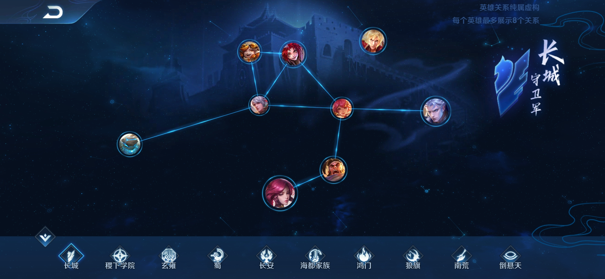
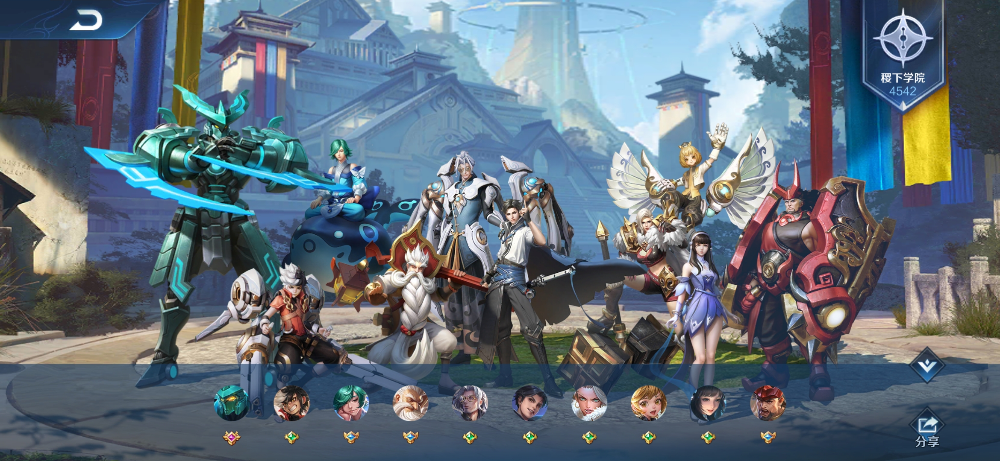
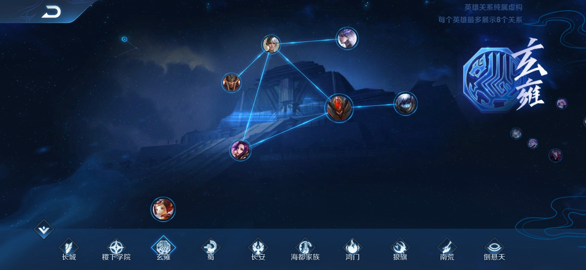
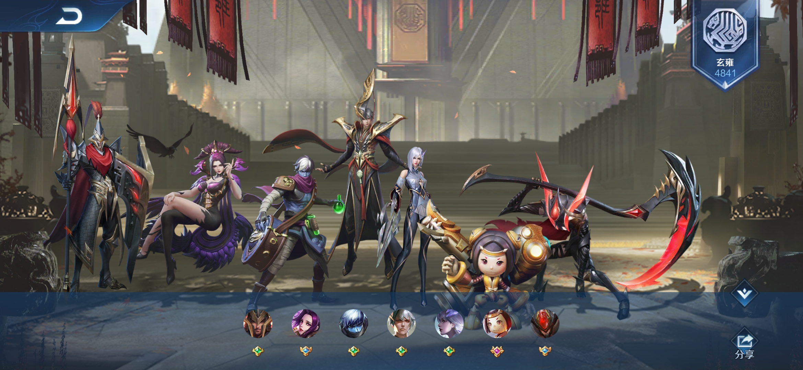
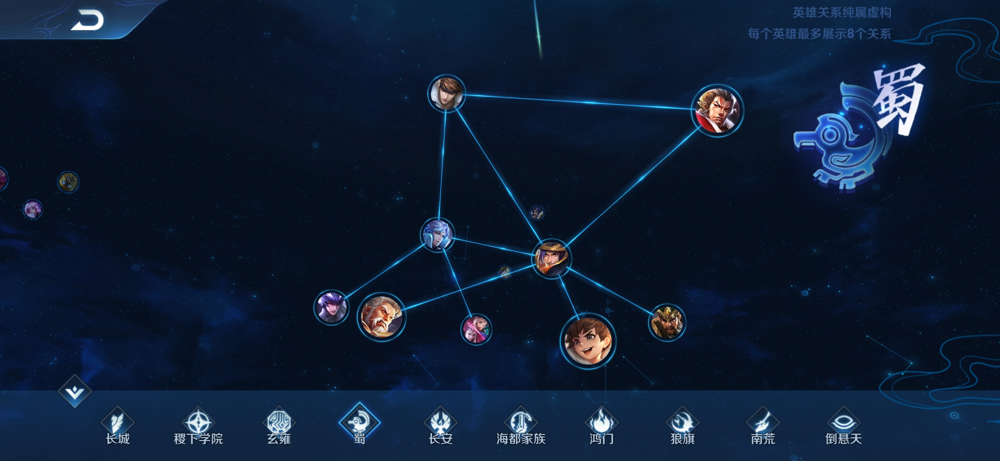
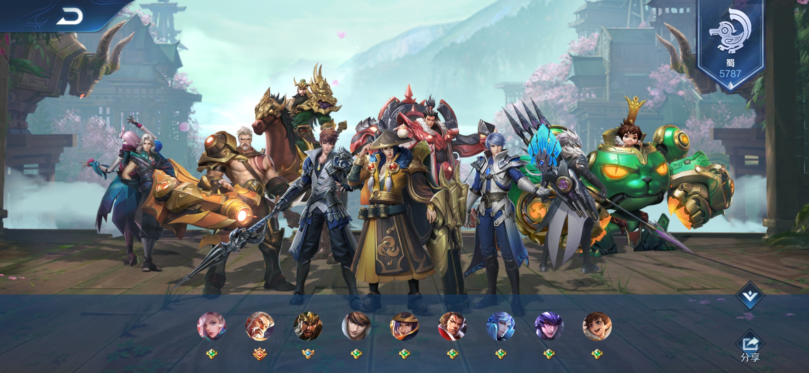
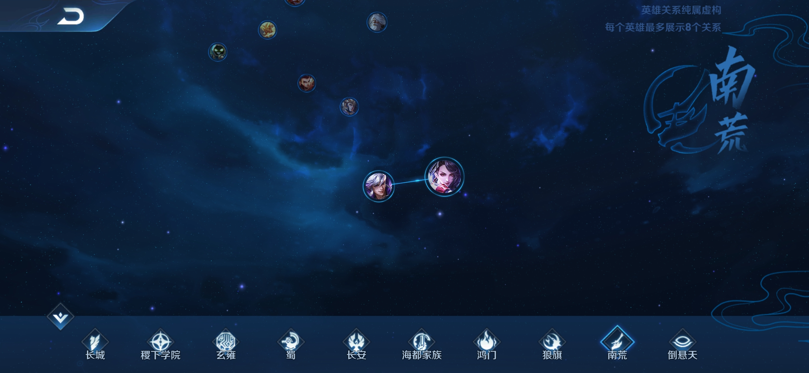

# 5v5手游《王者荣耀》

## 介绍
这是一款已经走过20个赛季的热门手游。模式仿自dota，采用5v5的多人推塔模式。目前已经拥有100个可购买的游戏英雄角色。

## 英雄阵营
目前分为 长城、稷下学院、 玄雍、蜀、 长安、海都家族、鸿门、狼旗、南荒、倒悬天 10个阵营，开放了前4个阵营的内容与任务奖励。

### 长城

### 稷下学院

### 玄雍

### 蜀

### 长安

### 海都家族

### 鸿门

### 狼旗

### 南荒

### 倒悬天

## 赛事机制
从低到高分为：青铜组、白银组、黄金组、铂金组、钻石组、星耀组、王者组。

### 黄金组
升到黄金组以上，只要赛季内获胜10场排位就会免费获赠一个赛季皮肤，每个赛季对应的英雄都不一样，获得皮肤时不论有没有该英雄都会收到。

### 钻石组
进入此组后之后开启征召模式的排位赛，每方禁用2名英雄，双方英雄不能重复。先禁的先选。

### 王者组
进入此组后可得到一个印记，显示在个人页，并开启巅峰赛模式，巅峰赛只能单排，更显示个人能力与临时队伍的合作能力。如果期间排位掉落到星耀三将临时禁止参加巅峰赛，返回星耀二以上即可。巅峰赛要求信誉分100，也就是不能出现挂机、骂人之类的违规扣分。

赛季通常为3~4个月不等，腾讯自已不知道按什么规律制定的，赛季结束会重新开始定位新赛季的排位。

### S19赛季全英雄图

