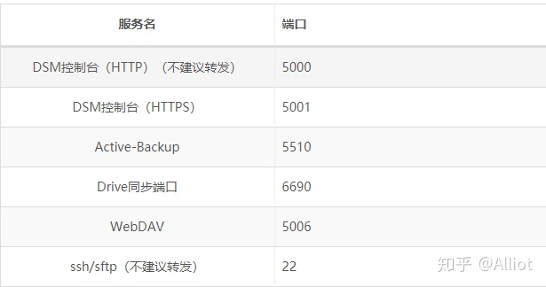

# 04月

## 1号
窗帘安装了上午一个半小时,然后我就一直在折腾网络配置与智能开关的分配,一个网线没装搞的增加许多麻烦,唉,好在现在能用了.虽然速度损失了一半.小蜗牛的NAS还是放在桌上用有线的吧,虽然噪音有点大,不过在阳台上应该也不会有什么感觉.

## 2号
早上宝宝突然说肚子疼，也不知道是真疼还是不愿意上学装的。带到医院检查了一下，医生建议多吃青菜，保持大便通畅再看。

然后从10点折腾到14点部署一招的电脑网络，由于乱七八糟的设置，搞的软路由无法上网，只好重置了一次，所有的DHCP绑定都没有了，唉，又要花几个小时找各设备的MAC地址。就因为装修的时候少放了一根网线，浪费了几个中午了，电信路由器与小米R3P的桥接效果非常的不好。有闲钱的时候再买一套mesh的路由器吧。中午只在一招吃了个汉堡，要学着好好做饭了。

在小米官网买了冰箱和净水器，实在是没时间去小米之家看货了。看了一下订单记录，居然我前一次官网下单还是2014看的事，一直都只是在小米有品和别的渠道购买小米的东西。

之前还特意看了R2S和R4S的对比：https://blog.qust.me/posts/nanopir4s/  然而实在是没心情与精力再折腾这些基础设施了，直接买了一个199的小路由，希望好用吧。

小路由到手后发现也是个openwrt的固件,只是内置了科学上网的工具,而且配置明显比小米R3P低,看来只要搞定在R3P上的安装就可行了,[这个工具](http://download.gl-inet.com/firmware/mt300n-v2/)真是太让我热爱了!! https://fastlink.ws/auth/register?code=Y02B

又看到一个[免费](https://yugogo.xyz/?page_id=3)的工具[winxray](https://www.winxray.com/),不过有个没办法解决的悖论,找资源要用谷歌,谷歌要翻墙,翻墙之后才能找资源,你NND

## 3号
今天上午就收到了小米的冰箱,空调和净水器,小米在大家电的配送上速度是真的快,下午定了宝宝床和两个床垫,5250,也没怎么细看了.整理一天一招的房子.期待下周彻底完工吧,现在就是水路的问题了.

## 6号
一个假期之后，房子的空调也安装好了，虽然有一些看着很不舒服的地方，但好在总算是可用了。网络与电视也全都就位了，就等今天智能锁的安装了，然后还有桌子的发错货问题。

这次装修房子真是小问题不断，好在没什么大问题了，不知道住几年之后会不会有问题，就像现在大发的房子到处都出了问题。洗衣机管道破了，马桶经常被堵。电灯总是有故障，厨房下水道总是有臭味，网络只能使用100M。

## 7号
一个上午把云米智能锁安装好了，安装师傅9点15分到场安装，20多分钟就安装好了锁体和外壳，但在设置开锁方向时被卡壳了40多分钟，在他自己通过工作群获得转向代码888#之后1分钟解决，加上之后他拍照完成工单，我再手机连接配置总共花了2个小时左右，小米新产品的工作真的很不完善呀。这个新发布的云米智能锁居然还不能接入蓝牙网关远程查看，只能近场蓝牙操作，这个估计是因为软件没有及时更新吧，后期相信能解决，不过要多久就不知道了，之前买的一个鹿客锁在三年后才正常接入网关远程查看。

然后中午接到小米有品的另一个订单配送电话，因为是第三方的百世快递派送的，那个服务态度之差真是牛X哄哄了，现在这些快递是怎么培养成这么垃圾的？记得以前刚开淘宝时快递态度都好到让人不好意思，上门送件还又是鞠躬又是感谢的，在居然变的这么垃圾，到底是快递业垃圾还是这片土地只能生长出垃圾？看看[全国网友的一个知乎帖](https://www.zhihu.com/question/266881648?utm_source=wechat_session)就知道这种现象不是某一个城市的特例。

## 8号
检修汽车漏机油的问题，看来中国的汽车6年还真是设定的好呀，正常使用6年后基本就开始各种问题出现了，是厂家故意的吗？

买的电动螺丝刀第二天中午就到货了，然后就很快地把鞋架安装成功了，唉，早一点买或许就少了很多事吧，手拧螺丝真的太累人了，现在安装东西太方便了！

然后就是云米智能锁的客服一直在跟进不能联动的问题，小米产业链下的服务果然还是不错的，只是能不能少一点这样的问题呢。

用koolshare的软路由固件中的下载工具下载了ubuntu20.10,这个控制台很有意思：http://www.nasdiy.net/aria2/

## 9号
I don't know how to input chinese at en ubuntu.but the english is very cool....may service is auto restort form cloud to the DELL pc.bad chinese network is hard to work.

找到一个在英文环境下最好用的拼音输入法：https://cloud.tencent.com/developer/article/1726671 

     sudo apt-get install fcitx-googlepinyin
     
一行代码搞定！

上午把桌子也安装完成了，再加上米家冰箱的噪音问题也得到了改善，现在就等明天安装床垫了。

下午上班期间回家一趟把纱窗也安装好了，走回去5分钟，安装5个纱窗15分钟，真是无语，来之前电话联系的常规都不知道。

## 10号
一个上午把宝宝床与大床都安装完成了.下午整理小东西,带老东西看一下午.

## 11号
从早上8点开启两台空调强制释放甲醛,全天基本都有0.08mg/m3 ,这说明家中的甲醛还是有比较高的,网上查了一下,超过0.05就不安全了.

两台空调对比一下发现旧空调耗电是新空调的3倍,差距真大呀,旧空调是13年买的格力,新空调是这次装修买的小米新风空调.都是设定为26度的室温.今天气温15度.

## 12号
还是忍不住下单800多买了一些小米的小工具，智能开关呀59，小爱音箱PLAY版299，大功率充电头109，人体感应器之类的，小米的东西每一样的确不贵，可是全用起来还真的是不便宜呀！

家里开窗透气和开新风空调的效果相比还是有点不一样的。毕竟甲醛还是有的。睡了一中午，有点头疼。。。

openwrt对DDNS的支持应该是很简单的，不知道为什么一直没搞定，要认真阅读一下官方文档：https://openwrt.org/docs/guide-user/services/ddns/client

## 13号
昨天下班后花了一个小时把小米r3p上安装了DDNS，并且已经连接成功了，其实很简单，只要配置好了cloudflare的API,然后就会自动更新了，默认的是10分钟检查一次，家用基本也够了，只是在填写域名domain时要用A@domain.com的格式，这一步容易写成A.domain.com，这样是会提示找不到域名的。配置是参考了[网上的博友教程](https://keesenz.com/2020/1067.html)，感谢互联网的开放与google的高效。

上午把厨房的窗帘安装好了，不过由于拉绳太长，我剪掉一段后导致不能完全收回了。。。检查的时候发现工人在左边只安装了一个螺丝，中国工人看来懒是真的懒，能打一个就绝对不会给你打两个螺丝。唉，这或许也是人的本性吧，这次装修遇到这种情况太多了。每个工人都是在尽可能的省事省料。

新的小爱音箱到货了，可惜所谓的pro的红外功能基本就是个废物，完全无法语音控制，配置也非常麻烦。还是就当个普通音箱用吧。说起来顺丰快递的速度与服务还真是不错，送货前打电话，速度也快，昨天中午下单的，今天上午就到货了。现在估计也就京东可以做到这个效率了吧。

中午奶奶和妈妈来看了一下装修过的房子，代沟的问题格外明显。

下午收高脚凳又跟快递吵一架，SB韵达快递不送上楼还态度恶劣，直接申请退款，什么玩意儿，淘宝早晚要被这些垃圾快递搞死。准备到京东自营店去买了。

## 14号
算了一下，所有电脑设备开着，一天要6度电左右，一个月差不多180度，本地电费0.5元左右，也就是一个月要100块的电费支持所有设备。想来还是有点浪费了，打算把R3P作为跳板机来使用，需要的时候跳上去唤醒一下对应的机器就好。现在需要解决唤醒命令和MAC地址记录的问题。这里有一个不错的参考：http://demon.tw/hardware/openwrt-wake-on-lan.html

          Wake-on-LAN简称WOL或WoL，一般翻译为“网络唤醒”、“远端唤醒”，通俗的说就是远程开机。

          OpenWrt提供了wol和etherwake两个包来实现WOL功能，随便安装一个即可，当然也可以两个都装。

          opkg update
          opkg install wol etherwake
          之前失败的罪魁祸首在于运行命令时只指定了MAC地址：

          /usr/bin/wol 40:8D:5C:1F:5D:18
          /usr/bin/etherwake 40:8D:5C:1F:5D:18
          这样会向255.255.255.255广播，但是不知为何电脑的网卡收不到，所以开不了机。

          正确的做法是，如果用wol，则需要指定向电脑所在的网段广播：

          /usr/bin/wol -i 192.168.1.255 40:8D:5C:1F:5D:18
          如果用etherwake，需要指定电脑所在局域网的接口：

          /usr/bin/etherwake -i br-lan 40:8D:5C:1F:5D:18
          不喜欢命令行的话也可以安装对应的LuCI包在网页上操作：

          opkg update
          opkg install luci-app-wol

今天中午把一个四位公牛排插用走线神器固定到了餐桌下方，好用多了。然后接着收小米的各种快递，第三方的东西真是差。同样的商品在淘宝只要28块钱，小米有品上卖68块，牛呀，退货还要自己寄，运费16，算了，留着做个警告吧。

找到一个群晖端口的说明：https://zhuanlan.zhihu.com/p/132515069

这个作者都知道国内封锁网络居然还用阿里云的DDNS...好吧，我们其实也的确没什么可以选择的，我选择了cloudflare.

又看到了一个有趣的网站：https://www.iopq.net/ 网游单机化，牛哈哈哈 https://www.iopq.net/thread-17106076-1-1.html

晚上宝宝自己用画画的方式做了一个小动画片,还讲了一段故事,非常棒的进步!

## 15号
用https://keymanager.org/ 找到了之前设置的SSL证书,导出后配置到群晖中也非常的简单,它是提供https://www.trustasia.com/ 一年认证的免费证书,非常棒,可惜还是不会用cloudflare的15年免费证书...

反正能用就行了,对吧.今天家中的厨房垫和书桌垫也到货了,质量都不怎么样,很大的气味,房子真的要多通风了.

突然想到用那个工具把cf的证书导入导出一次就行了!!!现在15年的证书部署到了蜗牛NAS上,哈哈,这机器都不一定能用15年呢.

## 16号
中午算是正式进房子睡觉了，楼下的摊贩乱搭的棚子也在下午全都拆掉了。最讨厌的油烟问题还是没有解决，石化一路还真是安庆的一块暗疮呀。看后续的治理效果吧。

## 18号
宝宝又因为吃饭的时候嫌子母做的菠萝虾太酸不肯吃被教训了一通，然后睡了2个多小时去上舞蹈课又发脾气不愿意上课。

## 19号
早上送被子进幼儿园，宝宝又不想在幼儿园吃早餐，被我教训了一通，哭了。。。小朋友也告状说她在幼儿园不吃菜，感觉这幼儿园真不怎么样了。

然后要求快递把放在菜鸟的包裹按地址送过来，这些垃圾快递真是太让人恼火了。

下午把机房最后几台电脑也恢复成了win7，现在只保留了一个fydeos测试用，还有一台电脑因为网线故障、两台电脑因为电路故障无法使用，机房算是彻底恢复了，可惜今天用大文件传输才发现这机房只是个百兆网络的，虽然在系统中显示是千兆网卡，完全只是win7的驱动显示而已，真实速度只能跑到100M。垃圾机房，这就是我国教育经费的浪费。当然，自己当年也没做相应的测试就验收了，不过就算我指出这个问题也无法阻止上级的付款，因为机房工程是领导安排的，我们并没有相应的决策权。

## 20号
主机安装了一个dvd rw驱动器，然后发现螺丝少了。。。同时意外发现花生壳盒子又掉线了，这个国产DDNS真是个垃圾，各种奇怪的错误，当然，其实更多的原因不是技术上的，而是现在政策太操蛋了。这种DDNS服务在国内肯定生存的很艰难吧。另一个新生DDNSTO服务现在也变得要经过本人微信认证后才可以访问，也就是基本废了，我TMD刚付钱买了一年，，，幸亏只买了一年，以后再也不会在国内的这些网络服务上花任何钱了，因为基本得不到任何保障，也没有什么好的体验，国内的线上服务不值得我们付费！

之前推荐单机网游的博客还有一个不错的群晖介绍列表：https://www.huakings.cn/category/foundations/

然后根据最新的[一则教育部信息](http://www.moe.gov.cn/srcsite/A06/s3325/202102/t20210207_512888.html)来看，网络教学基本要被严管了，也就是我们的创新估计没办法继续做下去了。

每个人都应该学会维护自己的权益，虽然过程中会生气，会愤怒，但最终，垃圾的服务会被淘汰出局。经过前几轮的快递投诉，现在每个快递送来之前都会打电话确认，并送货上门了，这就是投诉的力量。

现在就看投诉什么时候能把楼下的破饭店整治好。

下午准备找个[岳飞的小说](http://www.tychess.com/thread-57807-1-1.html)，发现资源全都私有化了，很好，中国互联网再次退回到BBS时代。[唯一的一个公开下载](http://mydbfx.com/?p=16210)速度也非常的慢。

真想加入FSF基金会呀，不过要交500美元。。。。没钱，看看吧：https://www.fsf.org/associate/benefits

打算下载一个Emacs学习，可是发现机房的网络好像被加入黑名单了，只好回家再下载了：https://www.gnu.org/software/emacs/

因为一个SB的读书活动,我不得不再安装一个视频编辑软件:https://www.lwks.com/ 并注册了,我已经很多年不做视频处理工作了.【这个软件的永久授权要500多美元，折合当前RMB要3000多呢】

## 21号
床边的夹缝柜到货了，还是个垃圾快递送来的，不过我忘记上次也是这垃圾快递了。。。。而且这次发的产品还有问题，抽屉面板少了2个孔，无法安装，我现在也没有相应的钻头可以使用。

淘宝的价低质次的产品还是太多了，万能的淘宝，可惜也是一个垃圾的淘宝。
